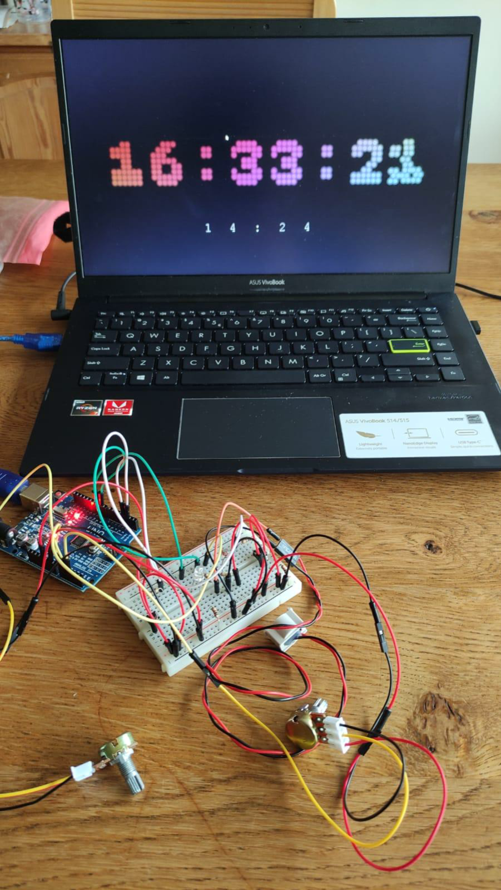
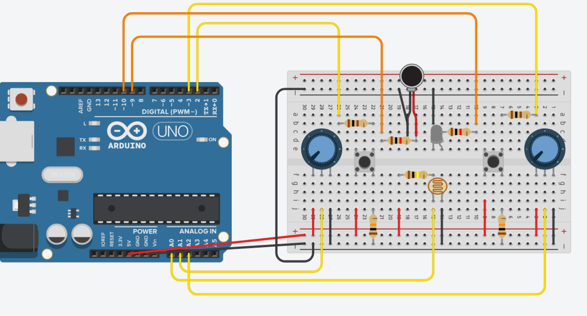

## Alarm Clock
Not a particularly smart alarm clock as the original name might suggest, this project combines the Arduino and programming knowledge from module 2 to create a system connecting the two in a mock practical application.

Processing is used as a fancy display, and Arduino is used to get inputs. Potentiometers are used to set the time. Buttons to enable, disable and snooze the alarm. A light sensor dims the display in the dark, and an LED and beeper let you know when the alarm rings.

Made by me and Denzel Hagen

