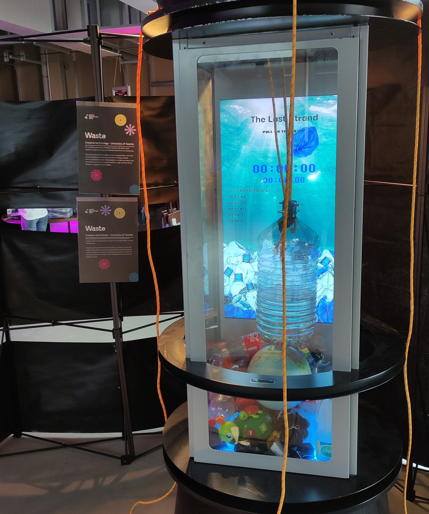

## The Last Strand

An art installation about working together to stop waste from entering the ocean. Multiple people must work together to hold up a jug to keep the plastic from entering the water. A counter keeps track of how long since the jug hit the planet. If people don't continuously work together to keep waste at bay, it will not get any better.

Uses an Arduino to sense the height of the jug, and Processing for the display behind. projectDisplay9 is the final version of the Processing code, not all code here is made by me. Processing_Weight is a test of the weight sensor smoothing code. interactiveDemo shows the general concept using spacebar presses. ClockDisplay was a test of the counter using particles to display numbers. Arduino_ultrasonic is the code running on the Arduino measuring the height of the jug.

Group project with 4 people total.

