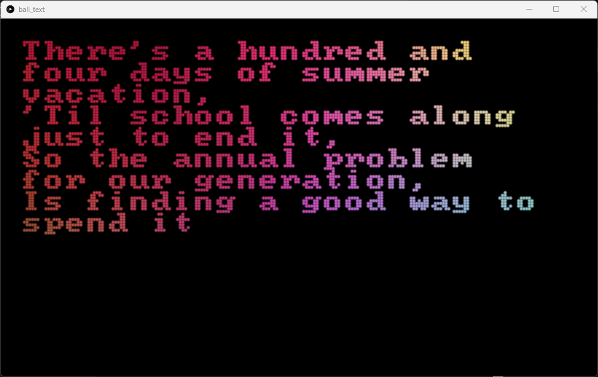

## Ball Text
This is a showcase of a system to display text from input.txt as a bunch of particles. The color of the particles follow the image in the data folder. Clicking animates the particles, and resizing the window makes the words wrap.

